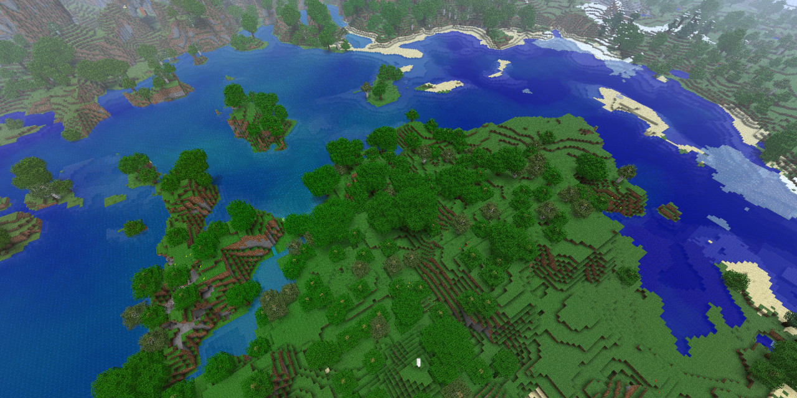

**For beta 1.7.3 and STAPI!**
# Biome Water
Simple mod adding biome water tint, working in the same way as vanilla grass and leaves tints based on climate.

- This mod uses modified colour map, instead of one left by Notch in game files.

*I tried to tweak dynamic texture code as best as possible, to reasemble vanilla vibrant and light texture, and also allowing tint. 
Not a fan of dark water in similar base class mods.*

## Texturepacks
It's easy to change colour map yourself with texturepack, by modifing `misc/watercolor.png` file.

If you change texturepack with watercolor.png, when world is already loaded, you will experience graphical glitches. Simply reload your world.

### Compatibility:
Mixins into:
- `LiquidBlock.class`
- `ArsenicStillWater.class`
- `ArsenicFlowingWater.class`

<ins>Mod works only on StAPI</ins> as it's mixin into StAPI's own renderer. 
Should work on any StAPI version with same Arsenic renderer.

~~I have almost complete babric no-stapi version on disc. If there's interest I could share it.~~

Didn't tested with custom water textures from texturepacks, as simply I didn't have one to test with.